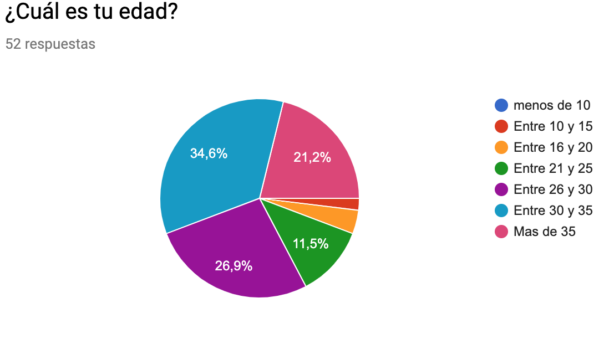
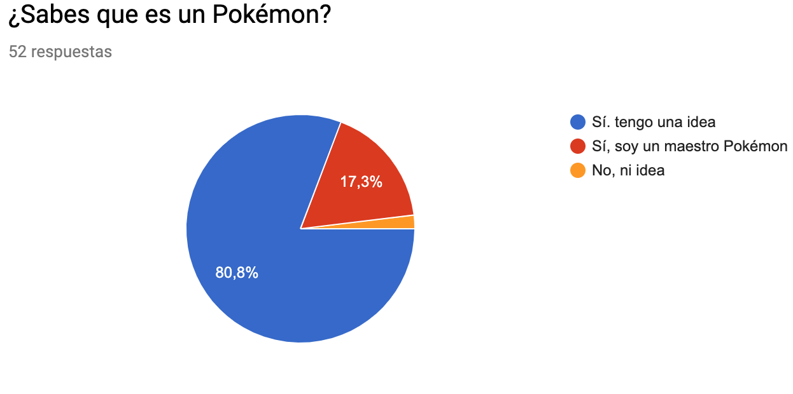
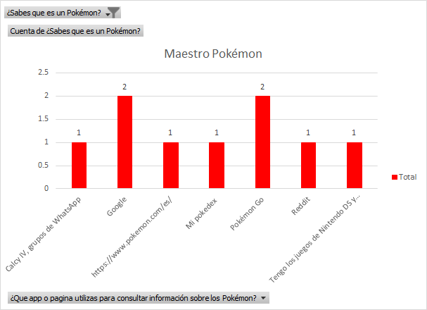
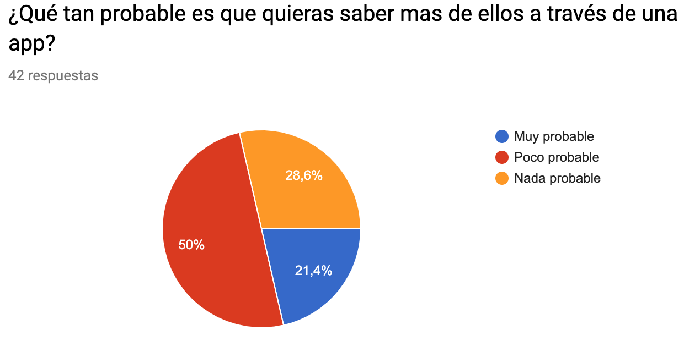
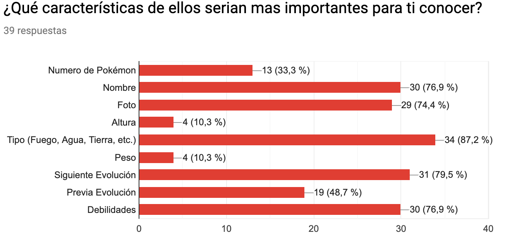
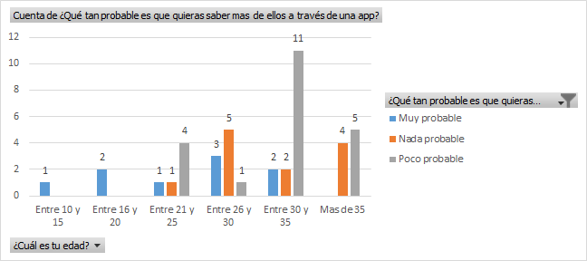

# Pokéxpert

Preguntas de inicio:

Cuántas veces has estado en una reunión en la que hablan de un tema que desconoces por completo?
Y cuántas veces has buscado algo en internet y terminas abrumado de toda la información que te aparece?
Bueno, pues no son las únicas. Les voy a contar una historia...

## Storytelling

Luis es un joven que hace poco conoció el juego PokémonGo, porque vio que la  mayoría de sus amigos lo jugaban y quiso saber qué es lo que tanto disfrutan de este juego. Luis se decidió a descarga el juego en su celular y de inmediato pudo capturar a su primer Pokémon, un Bulbasaur, y ahora empezaba a entender la emoción del juego, no podía esperar más para capturar al siguiente.

 Un día durante una reunión escuchó a sus amigos presumir todos los Pokémon que ya poseían, pero el no tenía ni idea de lo que era un Vulpix o un Snorlax y seguía escuchando nombres que ni siquiera podía pronunciar; se fue de esa reunión decidido a saber lo más que pudiera sobre los Pokémon. Le preguntó a sus amigos dónde podía buscar información y casi todos le  responden que puede buscar en google, en reddit, en calcy y otras páginas que el ni siquiera conoce, pero lo intenta; no dura mucho su búsqueda, después de tantos clicks, ventanas abiertas y mucha publicidad, se pregunta si no existe una app o una página sencilla donde sólo pueda consultar la información escencial para empezar a sumergirse en el mundo Pokémon.

  Finalmente, uno de sus amigos le enseña la app que él usa, se llama "Pokéxpert", Luis se decide a utilizarla y empieza a conocer a todos los Pokémon del universo aunque aún no se siente un maestro Pokémon. Después de estar horas inmerso investigando en el Pokéxpert ya tiene su Pokémon favorito, sabe sus debilidades y fortalezas y está más que decidido a capturar a cada Pokémon que se le cruce en el camino. Un par de semanas despúes Luis se vuelve a reunir con sus amigos para salir a capturar nuevos Pokémon, uno de ellos grita de emoción porque acaba de encontrar un Serperior y Luis no sabe qué es eso, pero no se preocupa porque, abre su Pokéxpert de inmediato e introduce el nombre que acaba de escuchar y en cuestión de segundos puede ver la foto y la información de este Pokémon.
  
   Ahora, Luis ya está listo para enfrentarse a ese nuevo Pokémon que acaba de conocer!

## Research

En la etapa de descubrimiento e investigación se realizó una pequeña encuesta con la herramienta **Google Forms**, donde se plantearon preguntas básicas para definir al usuario, conocer sus necesidades y, posteriormente,definir de qué manera podríamos solucionar esas necesidades con nuestro producto.

Las preguntas incluidas en la encuesta fueron:

1. ¿Cuál es tu edad?
2. ¿Cuál es tu género?
3. ¿Sabes qué es un Pokémon?
4. ¿Qué páginas o aplicaciones utilizas para consultar información sobre un Pókemon?
5. ¿Qué tan probable es que quieras saber más de ellos a través de un app?
6. ¿Qué características de ellos serían mas importantes para ti?

Los resultados de la encuesta son los siguientes:

Para consultar el detalle de la encuesta solo da click aqui [Encuesta](https://docs.google.com/forms/d/1tJGnAgtlCqnqvrWzWuQZs6nvSESzQ6HWGSOJAOwO7CY/edit#responses)

### Conclusiones

La mayor cantidad de personas que respondieron la encuesta tienen mas de 26 años.

El 50% de los encuestados son mujeres, el 48% son hombres y el resto no se identifican con ninguno de estos dos géneros.

La mayoría de los encuestados saben lo que es un Pokémon.

Aquellos encuestados que contestaron saber lo suficiente para considerarse maestros Pókemon utilizan alguna página web o herramienta para consultar información sobre los Pokémon.

Únicamente el 29% de los encuestados no están interesados en saber más sobre el tema a través de una app.

Las características más importantes para la mayoría de los usuarios son:

1. Tipo (87%).
2. Siguiente Evolución (79%).
3. Nombre (76%).
4. Debilidades (76%).
5. Foto (74%).

## Definición del Usuario

### Preguntas

-¿Quién es el usuario?

-¿Qué necesita el usuario?

-¿Cómo podemos satisfacer esa necesidad?

Con base en esta información pudimos definir nuestro User Persona:

**Usuario:** Luis Vázquez es un hombre de 30 años,  con interés en el tema de Pokémon.

**Necesidad:** Tener acceso a la información básica y escencial de los Pókemon sin tener que acceder a un buscador en la web.

**Solución:** Luis podrá consultar las características básicas de los Pokémon desde una plataforma exclusiva para eso.

1. Razón: Por qué adquirir este producto
2. Personaje principal: Luis Vázquez
3. Conflicto inicial: No hay una app/plataforma exclusiva para consultar información básica sobre los Pokémon.
4. Estructura: comienzo, nudo y desenlance
5. Creación de percepciones: crear emociones. Reforzar emociones positivas y disminuir las negativas
6. Viralidad: que se comparta la historia

## Ideación

-Benchmarking:

    1. Calcy IV
    2. Reddit
    3. www.pokemon.com.es

-Brainstorming:

    -Imagenes de fondo 
    -Iconos para botones
    -Interaccion en la intefaz
    -Cuantas secciones
    -Metodos de filtrado
    -Como mostrar las caracteristicas
    -etc...

## Prototipado

El primer prototipo diseñado para este proyecto considera las caracteristicas establecidas anteriormente buscando tener una interaccion dinamica y sencilla.
[Marvel](https://marvelapp.com/54bga3j)

Sketch:

## User testing

El siguiente paso es probar nuestro prototipo con los usuarios para obtener feedback.
